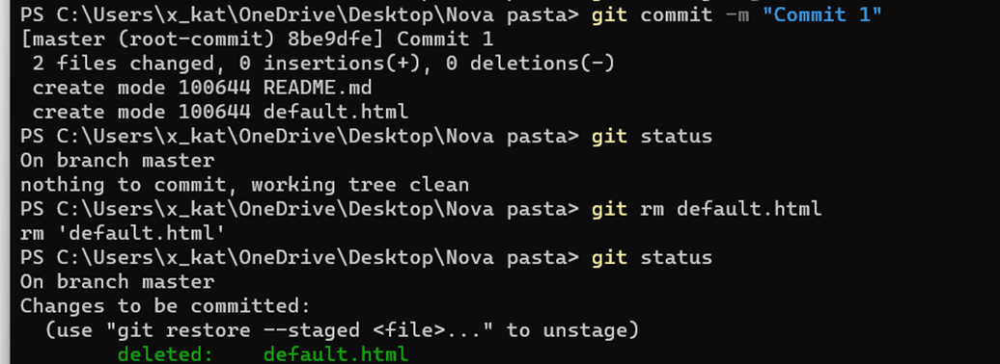

# Questão 3

Nesta questão vamos usar o Git e um editor de texto (nano), você pode realizar uma sequência de comandos em um diretório da sua máquina local, seguindo a sequência definida no exercício. 

Nessa sequência, o nano representa a abertura de um editor de texto para criar/editar o arquivo especificado como argumento e você deve salvar no arquivo um conteúdo qualquer, que foi salvo em disco antes de prosseguir com o próximo comando:

git init

nano README.md

nano default.html

git add .

git commit -m "Commit 1"

git rm default.html

nano style.css

git add style.css

git commit -m "Commit 2"

git checkout -b testing

nano script.js

git add *.js

git commit -m "Commit 3"

git checkout master

Ao final dessa sequência de comandos, os arquivos que se encontram em seu diretório de trabalho, além do README.md, é/são:

- [      ] script.js e style.css, apenas.
- [      ] default.html e style.css, apenas.
- [  X  ] style.css, apenas.
- [      ] default.html e script.js, apenas.
- [      ] default.html, script.js e style.css.

## Solução

git init
Cria um novo repositório do Git

nano README.md
Cria o arquivo README.md

nano default.html
Cria o arquivo default.html

git add .
Todos os arquivos do diretório de trabalho são adicionados/preparados ao Git 

	

git commit -m "Commit 1"
Feito o primeiro commit com a mensagem "Commit 1" 

git rm default.html
O arquivo default.html é removido do o arquivo default.html é removido do diretório de trabalho, registrando a remoção do arquivo no histórico de alterações. 
 

	

nano style.css
Cria o arquivo style.css 

git add style.css
O arquivo style.css é adicionado ao Git 

git commit -m "Commit 2"
É feito o segundo commit com a mensagem "Commit 2". 

git checkout -b testing
Criada uma nova branch chamada "testing". O comando "-b" indica que você deseja criar uma nova branch e mudar para ela imediatamente. O Git considerará a branch "testing" como a branch atual, onde novos commits serão registrados
 
 

	

nano script.js
Cria o arquivo script.js

git add *.js
O arquivo script.js é adicionado ao Git

git commit -m "Commit 3"
É feito o terceiro commit na branch "testing" com a mensagem "Commit 3"
 

	

	

 
git checkout master
Por fim, é feito o checkout para a branch "master". Após dar o checkout para a branch "master", o arquivo "script.js" não estará presente no diretório de trabalho. O arquivo "script.js" foi criado e commitado apenas na branch "testing", e não na branch "master".

 

	

