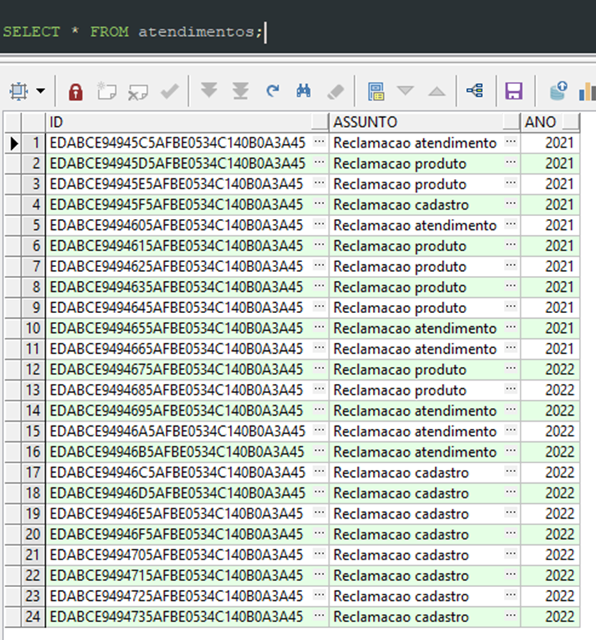
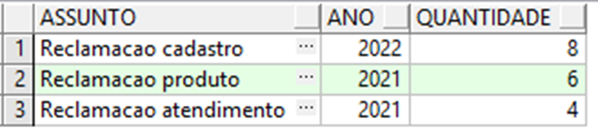

# Questão 4


Uma empresa registra os atendimentos por assunto e por ano em uma tabela.

Você precisa escrever um comando select que retorne o assunto, o ano e a quantidade de ocorrências, filtrando apenas assuntos que tenham mais de 3 ocorrências no mesmo ano.

O comando deve ordenar os registros por ANO e por QUANTIDADE de ocorrências de forma DECRESCENTE.

Dados existentes na tabela:

<p align="center">
	
</p>

Resultado esperado:
 
<p align="center">
	
</p>

Comandos para criação da tabela e inserção dos registros:

```bash
-- ORACLE
CREATE TABLE atendimentos (
 id  RAW(16) DEFAULT SYS_GUID() NOT NULL,
 assunto VARCHAR2(100) NOT NULL,
 ano NUMBER(4)
);

INSERT INTO atendimentos (assunto, ano) VALUES ('Reclamacao atendimento','2021');
INSERT INTO atendimentos (assunto, ano) VALUES ('Reclamacao produto','2021');
INSERT INTO atendimentos (assunto, ano) VALUES ('Reclamacao produto','2021');
INSERT INTO atendimentos (assunto, ano) VALUES ('Reclamacao cadastro','2021');
INSERT INTO atendimentos (assunto, ano) VALUES ('Reclamacao atendimento','2021');
INSERT INTO atendimentos (assunto, ano) VALUES ('Reclamacao produto','2021');
INSERT INTO atendimentos (assunto, ano) VALUES ('Reclamacao produto','2021');
INSERT INTO atendimentos (assunto, ano) VALUES ('Reclamacao produto','2021');
INSERT INTO atendimentos (assunto, ano) VALUES ('Reclamacao produto','2021');
INSERT INTO atendimentos (assunto, ano) VALUES ('Reclamacao atendimento','2021');
INSERT INTO atendimentos (assunto, ano) VALUES ('Reclamacao atendimento','2021');
INSERT INTO atendimentos (assunto, ano) VALUES ('Reclamacao produto','2022');
INSERT INTO atendimentos (assunto, ano) VALUES ('Reclamacao produto','2022');
INSERT INTO atendimentos (assunto, ano) VALUES ('Reclamacao atendimento','2022');
INSERT INTO atendimentos (assunto, ano) VALUES ('Reclamacao atendimento','2022');
INSERT INTO atendimentos (assunto, ano) VALUES ('Reclamacao atendimento','2022');
INSERT INTO atendimentos (assunto, ano) VALUES ('Reclamacao cadastro','2022');
INSERT INTO atendimentos (assunto, ano) VALUES ('Reclamacao cadastro','2022');
INSERT INTO atendimentos (assunto, ano) VALUES ('Reclamacao cadastro','2022');
INSERT INTO atendimentos (assunto, ano) VALUES ('Reclamacao cadastro','2022');
INSERT INTO atendimentos (assunto, ano) VALUES ('Reclamacao cadastro','2022');
INSERT INTO atendimentos (assunto, ano) VALUES ('Reclamacao cadastro','2022');
INSERT INTO atendimentos (assunto, ano) VALUES ('Reclamacao cadastro','2022');
INSERT INTO atendimentos (assunto, ano) VALUES ('Reclamacao cadastro','2022');
COMMIT;


```