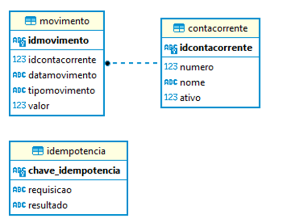

# Questão 5

Um banco que já possui uma API REST, necessita que você desenvolva duas novas funcionalidades:
- Movimentação de uma conta corrente;
- Consulta do saldo da conta corrente;

A API do banco já está funcionando, conectada a um banco Sqlite e as tabelas já foram criadas conforme modelo ER abaixo:

<p align="center">
	
</p>

Questao5\Infrastructure\Sqlite\DatabaseBootstrap.cs – Script utilizado na inicialização


```bash
CREATE TABLE contacorrente (
	idcontacorrente TEXT(37) PRIMARY KEY, -- id da conta corrente
	numero INTEGER(10) NOT NULL UNIQUE, -- numero da conta corrente
	nome TEXT(100) NOT NULL, -- nome do titular da conta corrente
	ativo INTEGER(1) NOT NULL default 0, -- indicativo se a conta esta ativa. (0 = inativa, 1 = ativa).
	CHECK (ativo in (0,1))
);

CREATE TABLE movimento (
	idmovimento TEXT(37) PRIMARY KEY, -- identificacao unica do movimento
	idcontacorrente TEXT(37) NOT NULL, -- identificacao unica da conta corrente
	datamovimento TEXT(25) NOT NULL, -- data do movimento no formato DD/MM/YYYY
	tipomovimento TEXT(1) NOT NULL, -- tipo do movimento. (C = Credito, D = Debito).
	valor REAL NOT NULL, -- valor do movimento. Usar duas casas decimais.
	CHECK (tipomovimento in ('C','D')),
	FOREIGN KEY(idcontacorrente) REFERENCES contacorrente(idcontacorrente)
);

CREATE TABLE idempotencia (
	chave_idempotencia TEXT(37) PRIMARY KEY, -- identificacao chave de idempotencia
	requisicao TEXT(1000), -- dados de requisicao
	resultado TEXT(1000) -- dados de retorno
);

INSERT INTO contacorrente(idcontacorrente, numero, nome, ativo) VALUES('B6BAFC09-6967-ED11-A567-055DFA4A16C9', 123, 'Katherine Sanchez', 1);
INSERT INTO contacorrente(idcontacorrente, numero, nome, ativo) VALUES('FA99D033-7067-ED11-96C6-7C5DFA4A16C9', 456, 'Eva Woodward', 1);
INSERT INTO contacorrente(idcontacorrente, numero, nome, ativo) VALUES('382D323D-7067-ED11-8866-7D5DFA4A16C9', 789, 'Tevin Mcconnell', 1);
INSERT INTO contacorrente(idcontacorrente, numero, nome, ativo) VALUES('F475F943-7067-ED11-A06B-7E5DFA4A16C9', 741, 'Ameena Lynn', 0);
INSERT INTO contacorrente(idcontacorrente, numero, nome, ativo) VALUES('BCDACA4A-7067-ED11-AF81-825DFA4A16C9', 852, 'Jarrad Mckee', 0);
INSERT INTO contacorrente(idcontacorrente, numero, nome, ativo) VALUES('D2E02051-7067-ED11-94C0-835DFA4A16C9', 963, 'Elisha Simons', 0);

```

Observação:
- Como o objetivo da API não é cadastrar contas, as contas correntes já foram inseridas via script.

As APIs da empresa geralmente utilizam:
- Dapper – Componente para conexão com o banco de dados.
- CQRS - Command Query Responsibility Segregation;
- Mediator - Padrão de projeto comportamental que permite que você reduza as dependências caóticas entre objetos;
- Swagger – Todos os serviços são documentados usando Swagger, todos os atributos são documentados, todos as requisições e retornos possíveis são documentados e com exemplos.
- Testes Unitários – Para garantir a qualidade, a empresa costuma implementar testes unitários, as integrações e bancos de dados são normalmente mockados, geralmente usando NSubstitute.

Para este teste não é obrigatório utilizar esses padrões e tecnologias, mas se você conhecer e puder utilizar contará pontos extras na avaliação.

## Serviço: Movimentação de uma conta corrente

Um aplicativo da empresa necessita se integrar com esta API que você vai construir para movimentar a conta corrente.

O novo serviço deve requisitar a identificação da requisição, identificação da conta corrente, o valor a ser movimentado, e o tipo de movimento (C = Credito, D = Débito).

É importante que a API seja resiliente a falhas, pois o aplicativo que utiliza a API pode perder a conexão com a API antes de receber a resposta e então nestes casos o comportamento é repetir a mesma requisição até que o aplicativo receba um retorno. Para tornar o serviço seguro, pode-se criar o conceito de Idempotência que pode ser implementado por meio da identificação da requisição.

O serviço deve realizar as seguintes validações de negócio:
- Apenas contas correntes cadastradas podem receber movimentação; TIPO: INVALID_ACCOUNT.
- Apenas contas correntes ativas podem receber movimentação; TIPO: INACTIVE_ACCOUNT.
- Apenas valores positivos podem ser recebidos; TIPO: INVALID_VALUE.
- Apenas os tipos “débito” ou “crédito” podem ser aceitos; TIPO: INVALID_TYPE.


Caso os dados sejam recebidos e estejam válidos, devem ser persistidos na tabela MOVIMENTO e deve retornar HTTP 200 e retornar no body Id do movimento gerado.

Caso os dados estejam inconsistentes, deve retornar falha HTTP 400 (Bad Request) e no body uma mensagem descritiva de qual foi a falha e o tipo de falha.

Serviço: Saldo da conta corrente

O aplicativo da empresa necessita exibir o saldo atual da conta corrente.

Você deve desenvolver um serviço que recebe a identificação da conta corrente e retorne o saldo atual da conta corrente.

Para calcular o saldo da conta corrente, a API deve contabilizar os movimentos persistidos até o momento.

Fórmula:
SALDO = SOMA_DOS_CREDITOS – SOMA_DOS_DEBITOS

Observação: Caso a conta não possua nenhuma movimentação, a API deve retornar o valor 0.00 (Zero).

O serviço deve realizar as seguintes validações de negócio:
- Apenas contas correntes cadastradas podem consultar o saldo; TIPO: INVALID_ACCOUNT.
- Apenas contas correntes ativas podem consultar o saldo; TIPO: INACTIVE_ACCOUNT.

Caso os dados sejam recebidos e estejam válidos, deve retornar HTTP 200 e retornar no body com os seguintes dados:
- Número da conta corrente
- Nome do titular da conta corrente
- Data e hora da resposta da consulta
- Valor do Saldo atual

Caso os dados estejam inconsistentes, deve retornar falha HTTP 400 (Bad Request) e no body uma mensagem descritiva de qual foi a falha e o tipo de falha.
